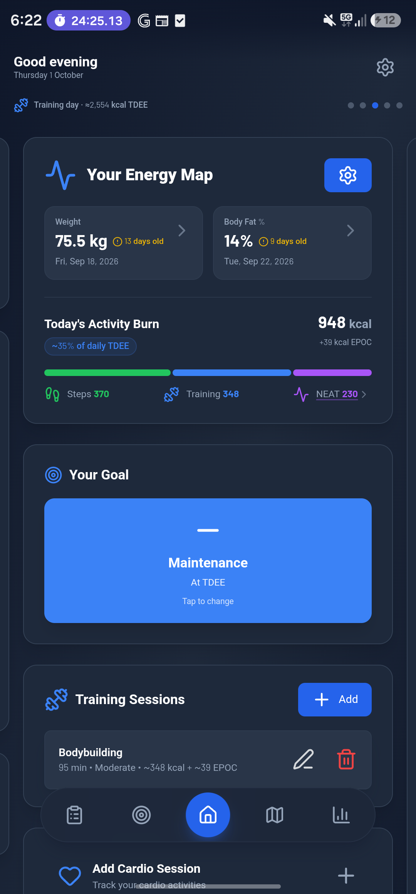
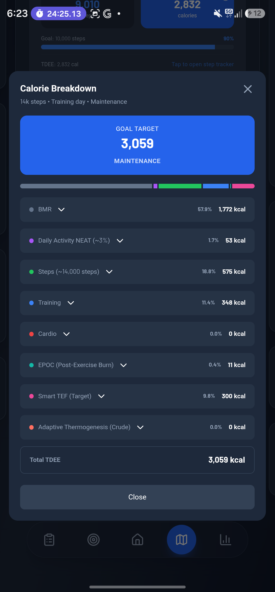
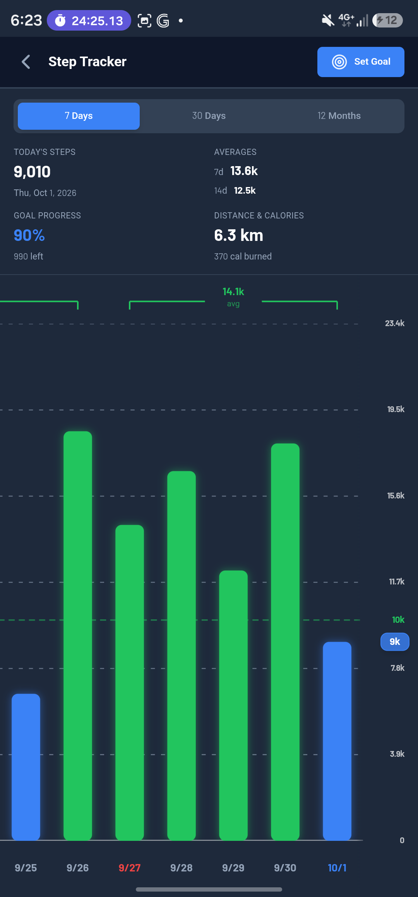
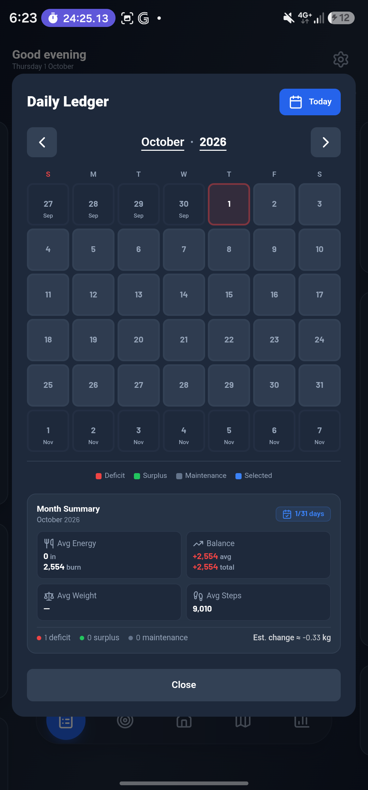
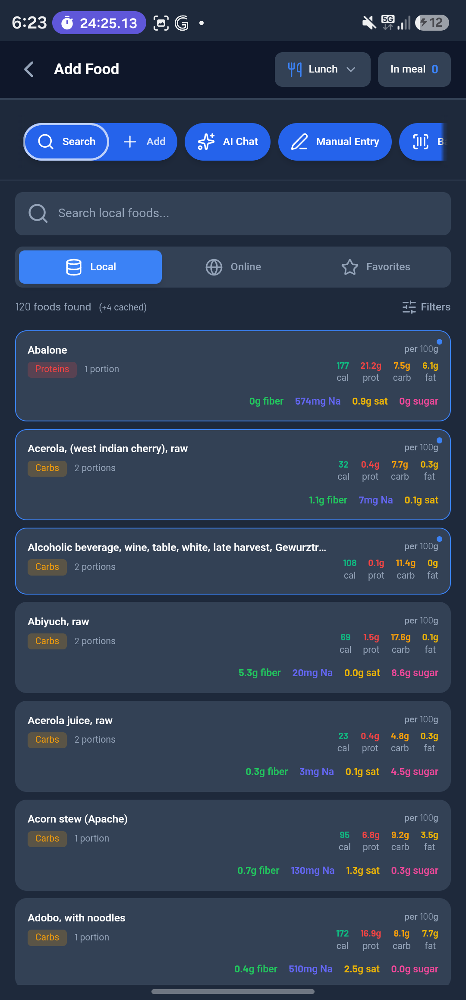
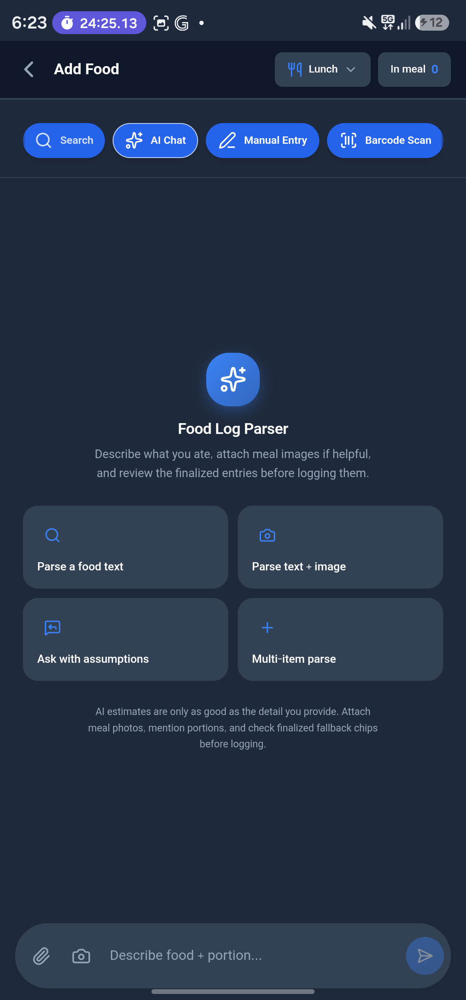
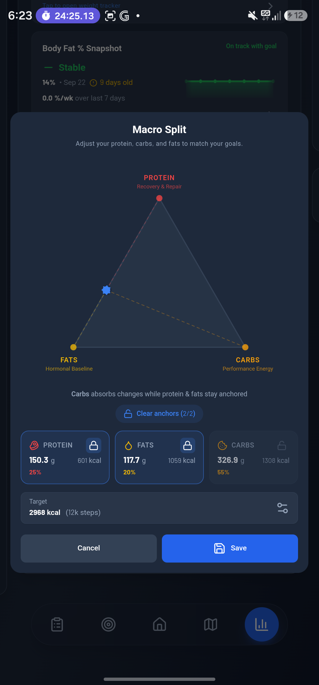
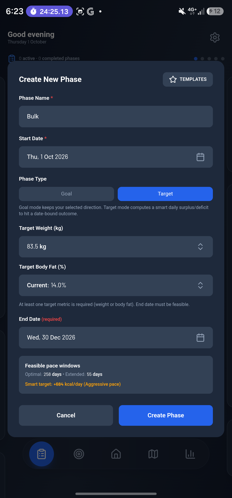

# Energy Map Calorie Tracker

<p align="center">
  
  
  
</p>

**Energy Map Calorie Tracker** is a local-first calorie and energy-balance tracker for iOS and Android that refuses to hand you a static number. Every day it rebuilds your true Total Daily Energy Expenditure — BMR, activity (NEAT), net steps, exercise, EPOC, TEF and adaptive thermogenesis — and applies your goal or phase on top, so the target you eat against reflects what your body actually burned. Log meals by search, barcode or AI chat against a bundled 13,000-food offline catalog, sync steps from Health Connect or Apple Health, and follow weight, body fat, macros and phases through date-keyed Daily Ledger and rolling energy-balance analytics.

It ships as a single **React + Vite** bundle wrapped by **Capacitor** into native apps, with on-device persistence (Dexie/IndexedDB + Capacitor Preferences), a `sql.js`-queried SQLite food catalog, and Supabase / OpenFoodFacts / OpenRouter behind the online features.

## 📸 Screenshots

<p align="center">
  
  
  
  
</p>

<p align="center">
  
  
  
  
</p>

## 🎯 Features

- **Comprehensive Calorie Tracking** — Foods, steps, cardio, and training sessions
- **Smart TDEE Calculations** — BMR (Mifflin-St Jeor / Katch-McArdle), activity multipliers, EPOC, adaptive thermogenesis, Smart TEF
- **Phase Management** — Dual-mode phase creation (`goal` / `target`) with smart planning, always-visible goal prediction card, and daily logs/metrics
- **Phase-Based Analytics** — Weight trends, nutrition rollups, daily snapshots
- **Barcode Scanning** — Native barcode lookup via Capacitor
- **Step Sync** — Health Connect on Android, read-only HealthKit on iOS, through one hook (no step double-counting)
- **Daily Ledger & Rolling Energy Balance** — Date-keyed snapshot analytics: a calendar ledger plus 3/7/14/28-day energy-balance rollups
- **Offline-First** — SQLite local food catalog (13k+ foods) queried in-browser via `sql.js`, IndexedDB history
- **AI-Powered Food Parsing** — OpenRouter-backed food entry assistance with Fast / Balanced / Precision quality modes
- **Bundle-Split Performance** — Heavy modals and data/AI services are lazy-loaded to reduce startup cost
- **8 Theme Modes** — Auto, Dark, Light, Darker (AMOLED), Forest, Dawn, Dusk, Midnight
- **Mobile-Optimized UI** — Touch-first design, no hardcoded colors, semantic tokens
- **Native Delivery** — One web bundle wrapped as an SPM-native iOS app and an Android app, with exports handed to the OS share sheet on device

## 🧮 Theoretical Foundation (The TDEE Stack)

Energy Map Calorie Tracker abandons static daily targets in favor of a dynamically rebuilt Total Daily Energy Expenditure (TDEE) stack for each day. The calculation is mathematically rigorous and resolves layer-by-layer to ensure energy balance accuracy.

$$
\text{TDEE} = \text{BMR} \times \text{NEAT}_{\text{adj}} + \text{Steps}_{\text{net}} + \text{Exercise} + \text{EPOC} + \text{TEF} + \text{AT}_{\text{correction}}
$$

### 1. Basal Metabolic Rate (BMR)

By default, the system uses the **Mifflin-St Jeor** equation. If body fat tracking is enabled with valid entries, it automatically upgrades to the **Katch-McArdle** formula, utilizing Lean Body Mass (LBM) for superior accuracy.

**Mifflin-St Jeor** (where s = +5 for men, −161 for women):

$$
\text{BMR} = 10 \times \text{weight (kg)} + 6.25 \times \text{height (cm)} - 5 \times \text{age (y)} + s
$$

**Katch-McArdle:**

$$
\text{BMR} = 370 + (21.6 \times \text{LBM})
$$

### 2. Activity Multiplier (NEAT) & Smart TEF

Non-Exercise Activity Thermogenesis (NEAT) is calculated via user-defined activity multipliers. When **Smart TEF** (Thermic Effect of Food) is enabled, the system subtracts a 0.1 baseline from the raw multiplier (to decouple implicit TEF) and adds actual macro-calculated TEF back:

$$
\text{NEAT}_{\text{burn}} = \text{BMR} \times (\text{Multiplier}_{\text{raw}} - 0.1)
$$

$$
\text{TEF} = (\text{Protein}_g \times 4 \times 0.25) + (\text{Carbs}_g \times 4 \times 0.08) + (\text{Fat}_g \times 9 \times 0.02)
$$

### 3. Algorithmic Step Overlap Deduction

To prevent double-counting when users rely on both a pedometer and log ambulatory cardio sessions (e.g., running), steps are mathematically deducted proportional to the cardio time and cadence:

$$
\text{Steps}_{\text{net}} = \text{Steps}_{\text{total}} - \sum (\text{Cardio}_{\text{duration}} \times \text{Cadence}_{\text{preset}})
$$

Net steps are then converted to calories using a stride-length heuristic (Height × 0.415).

### 4. Exercise EPOC & Date Carryover

Post-exercise oxygen consumption burn (EPOC) is modeled and distributed across an adjustable carryover window (default: 6 hours). If a late-night workout spills over midnight, the algorithm fragments the EPOC calories between Day 1 (today) and Day 2 (tomorrow as "carry-in" calories):

$$
\text{EPOC}_{\text{day}} = \text{EPOC}_{\text{total}} \times \left( \frac{\text{Minutes prior to midnight}}{\text{Window duration}} \right)
$$

### 5. Adaptive Thermogenesis (AT)

An algorithmic feedback loop with crude and smart modes. Crude mode accumulates signed balance pressure over up to 28 days of daily-goal history (cut days deepen it, surplus unwinds it quickly, maintenance decays it — so isolated goal switches never reset weeks of adaptation) and maps that pressure to −250…+150 kcal/day milestones. Smart mode derives a bounded correction from historical snapshot and weight-trend signals, with configurable EMA or SMA smoothing, and clamps the correction to ±300 kcal/day:

$$
\Delta_{\text{metabolic}} = \text{Expected Weight Change} - \text{Actual Weight Change}
$$

$$
\text{AT}_{\text{correction}} = \text{Clamp}(\Delta_{\text{energy}},\ -300,\ 300)
$$

**The Final Target:** Your specific physiological goal (e.g. −500 kcal for fat loss) is applied directly to this robustly calculated baseline:

$$
\text{Target Calories} = \text{TDEE} + \Delta_{\text{goal}}
$$

## 🛠 Tech Stack

| Layer | Technology | Version |
|-------|-----------|---------|
| **Frontend** | React | 18.3.1 |
| **Build & Dev** | Vite (Rolldown) | 8.x |
| **Mobile Wrapper** | Capacitor | 8.x |
| **State Management** | Zustand | 4.5.x |
| **History Storage** | Dexie (IndexedDB) | 4.x |
| **Settings Storage** | @capacitor/preferences | — |
| **Food Catalog** | SQLite (sql.js WASM) | — |
| **Animations** | Framer Motion | 12.x |
| **Styling** | Tailwind CSS | 3.4.x |
| **Icons** | Lucide React | 0.562.0 |
| **Testing** | Node test runner (logic) + Vitest/jsdom (UI) | — |
| **External APIs** | Supabase food catalog (seeded from USDA FDC), OpenFoodFacts, OpenRouter | — |

**Key Capacitor Plugins:**
- `@capacitor/preferences`, `@capacitor/app`, `@capacitor/status-bar`, `@capacitor/keyboard`, `@capacitor/barcode-scanner`, `@capgo/capacitor-health`, `@capgo/capacitor-navigation-bar`, `@capacitor/filesystem`, `@capacitor/share`

**Both native platforms are supported:** Android (Health Connect + nav-bar theming + hardware back button) and iOS (HealthKit + native share sheet). Platform-divergent behaviour is resolved centrally through `src/utils/platform.js` — see [Platform Awareness](#-platform-awareness).

## 🏗 Architecture

### Store + Orchestrator Pattern

```
App.jsx (theme management, store hydration gate)
  └─ EnergyMapCalculator.jsx (orchestrator, 5,100+ lines)
      ├─ 5-screen carousel (`useSwipeableScreens`)
      │   ├─ LogbookScreen
      │   ├─ TrackerScreen
      │   ├─ HomeScreen (default)
      │   ├─ CalorieMapScreen
      │   └─ InsightsScreen
      ├─ PhaseDetailScreen (drill-down, not in the carousel)
      ├─ AppHeader + ScreenTabs (header zone + floating glass tab bar)
      └─ 48 top-level modals + ~21 child-level modals

Performance loading strategy:
  - Fullscreen heavy modals are lazy-loaded (`React.lazy` + `Suspense`)
  - Additional high-traffic modals (`CalorieBreakdown`, `Training`, `Cardio`, `PhaseCreation`, `DailyLog`) are also lazy-loaded
  - Lazy modal mounts are guarded by `isOpen || isClosing` to preserve exit animations
  - `foodCatalog` and `openrouter` services are loaded dynamically in heavy flows

Persistence:
  Profile (settings/stats)  → Capacitor Preferences
  History (data)           → Dexie (IndexedDB)
    ├─ weightEntries
    ├─ bodyFatEntries
    ├─ stepEntries
    ├─ nutritionData
    ├─ phaseLogV2
    ├─ cardioSessions
    ├─ trainingSessions
    ├─ cachedFoods
    ├─ dailySnapshots
    └─ dailyNeatOverrides
```

`dailySnapshots` and `dailyNeatOverrides` are further **sharded by date** (`dailySnapshots:YYYY-MM-DD`) so only changed days are written.

### Data Flow

```
User Action
  → Store action (updateUserData)
  → deriveState() recalculates (with cached hot-path helpers)
  → Zustand re-renders subscribers
  → Debounced save (1s)
  → Profile save (Preferences, only if payload changed)
  → History save (Dexie, only changed documents)
```

### Derived State & Calculations

The store's canonical fields (computed via `deriveState`) are:
- `bmr`, `trainingCalories`, `totalCardioBurn`, `tdee`
- Sorted entry arrays, resolved type catalogs, phase projections
- Daily snapshots cache

**Never duplicate these calculations.** Always consume from the store.

## 📁 Project Structure

```
src/
├─ components/EnergyMap/
│   ├─ EnergyMapCalculator.jsx    # Main orchestrator
│   ├─ modals/                     # 59 modal components (6 subfolders) + 6 panel helpers
│   │   ├─ fullscreen/             # WeightTracker, BodyFatTracker, StepTracker, Settings, FoodSearch,
│   │   │                          #   AdaptiveThermogenesis, RollingEnergyBalance
│   │   │   └─ panels/             # FoodSearch sub-panels (chat, results, favourites, meal preview,
│   │   │                          #   filter controls, entry card)
│   │   ├─ pickers/                # Value selectors (Age, Calendar, Duration, Macro, Numeric, etc.)
│   │   ├─ info/                   # Info/reference modals (BmiInfo, BmrInfo, TefInfo, DayLedger, etc.)
│   │   ├─ forms/                  # Data entry (CardioModal, GoalModal, PhaseCreationModal,
│   │   │                          #   DailyNeatOverrideModal, etc.)
│   │   ├─ lists/                  # Browseable lists (CalorieTarget, CardioFavourites, DayLedgerList, ...)
│   │   └─ common/                 # ConfirmActionModal
│   ├─ common/                     # Shared chrome (ModalShell, AppHeader, ScreenTabs,
│   │                              #   TrackerSelectionCard, FoodTagBadges, DateInput)
│   └─ screens/                    # 5 carousel screens + PhaseDetailScreen
├─ store/
│   └─ useEnergyMapStore.js        # Zustand store (state, actions, derived values, persistence)
├─ utils/
│   ├─ calculations/               # Core calorie formulas and related helpers
│   │   ├─ calculations.js         # BMR, TDEE, cardio, training, TEF, AT, EPOC
│   │   ├─ adaptiveThermogenesis.js
│   │   ├─ dailySnapshots.js       # Derived snapshot builder + equality helpers
│   │   ├─ dayLedgerPresentation.js # Daily Ledger display models (read-only snapshot projections)
│   │   ├─ epoc.js
│   │   ├─ goalAlignment.js
│   │   ├─ phaseTargetPlanning.js  # Target-mode planning + goal-mode projection helpers
│   │   ├─ macroRecommendations.js
│   │   ├─ rollingEnergyBalance.js # 3/7/14/28-day rolling energy-balance rollup
│   │   ├─ sessionCarryover.js
│   │   └─ steps.js
│   ├─ data/                       # Persistence, date keys, phase-log normalization
│   │   ├─ dateKeys.js
│   │   ├─ historyDatabase.js
│   │   ├─ phaseLogV2.js
│   │   └─ storage.js
│   ├─ measurements/               # Weight, body fat, and profile sanitization helpers
│   │   ├─ bodyFat.js
│   │   ├─ profile.js
│   │   └─ weight.js
│   ├─ food/                       # Food presentation, tags, and AI merge/normalization helpers
│   │   ├─ aiFinalizedEntryState.js # Finalized chat entry card badges/labels
│   │   ├─ aiPresentationMerge.js  # Presentation → verified merge guardrails
│   │   ├─ foodPresentation.js
│   │   ├─ foodTags.js
│   │   └─ portionNormalization.js # Portion → grams normalization + per-100g scaling
│   ├─ formatting/                 # Number/time formatting helpers
│   │   ├─ format.js
│   │   └─ time.js
│   ├─ phases/                     # Phase metrics helpers
│   │   └─ phases.js
│   ├─ visuals/                    # Path, carousel, scroll, and tracker helpers
│   │   ├─ bezierPath.js           # Bézier paths + gap-aware chart path runs
│   │   ├─ carouselLoop.js         # Canonical swipe-shell loop math (offsets, settles, fades)
│   │   ├─ modalStack.js           # Modal z-lane + backdrop opacity math
│   │   ├─ scroll.js
│   │   └─ trackerHelpers.jsx
│   ├─ healthConnectWindow.js      # Health read-window building + max-per-source step aggregation
│   ├─ platform.js                 # Canonical platform resolution (getPlatform/isNative/isIOS/isAndroid)
│   ├─ theme.js                    # Native theme application (per-platform appliers)
│   └─ export.js                   # CSV/JSON export generation
├─ services/
│   ├─ foodCatalog.js              # SQLite local food search (sql.js)
│   ├─ foodCache.js                # Cache dedupe/trim helpers
│   ├─ foodCloud.js                # Supabase catalog online search
│   ├─ foodLookupContext.js        # AI lookup context + diagnostics metadata
│   ├─ foodLookupReasons.js        # Canonical lookup reason codes/labels
│   ├─ foodSearch.js               # Local/online-catalog/grounded lookup orchestration
│   ├─ openFoodFacts.js            # OpenFoodFacts barcode lookup
│   ├─ openrouter.js               # AI food parsing client (extraction/presentation/grounding)
│   ├─ ragBudget.js                # RAG stage timing/budget constants
│   ├─ ragChatPipeline.js          # Extraction → retrieval → verification → presentation
│   ├─ ragTelemetry.js             # RAG telemetry aggregation
│   ├─ barcodeScanner.js           # Capacitor barcode-scanner wrapper
│   └─ fileShare.js                # Export delivery (web download / native share sheet)
├─ hooks/
│   ├─ useAnimatedModal.js         # Modal lifecycle (isOpen/isClosing/requestClose)
│   ├─ useHardwareBackButton.js    # Android back handling (home-first + double-exit; no-op on iOS)
│   ├─ useSwipeableScreens.js      # 5-screen looping carousel (edge peek, compositor settles)
│   ├─ useHealthConnect.js         # Step sync (Health Connect on Android, read-only HealthKit on iOS)
│   └─ useNetworkStatus.js         # Online/offline detection
├─ constants/
│   ├─ activity/                   # Activity multipliers and presets
│   ├─ cardio/                     # Cardio metadata and cadence/ambulatory flags
│   ├─ food/                       # Food category metadata + bundled foodDatabase.sqlite
│   ├─ goals/                      # Goal definitions
│   ├─ health/                     # Health-store vocabulary (status + source names)
│   ├─ meal/                       # Meal type ordering/helpers
│   ├─ nutrients/                  # Micro nutrient defs, clamps, source-scoped invariants
│   └─ phases/                     # Phase templates
└─ tests/                          # UI-tier harness only (Capacitor doubles + jsdom setup)
```

The **logic tier lives at the repo root** (`tests/**/*.test.js`, run by `node --test`); UI specs live beside their
sources as `src/**/*.spec.{js,jsx}` (Vitest). Offline catalog tooling sits in `scripts/food-db/`.

## 🚀 Getting Started

### Installation

```bash
npm install
```

### Development

```bash
npm run dev              # Vite dev server (localhost:5173, strictPort)
```

### Production Build

```bash
npm run build            # Build → dist/
npx cap sync             # Sync native projects (also updates the iOS SPM manifest)
npx cap copy android     # Web assets only, no Gradle (what CI uses)
npx cap open android     # Open in Android Studio
npx cap open ios         # Open in Xcode (macOS only)
```

### iOS

The `ios/` project is **Swift Package Manager native** (`ios.packageManager: "SPM"`) — every Capacitor plugin ships a `Package.swift`, so **CocoaPods is not required** and `pod install` is never run. Minimum deployment target is **iOS 15.0** (required by `@capacitor/barcode-scanner`).

The Android flow maps **one-to-one**; only the platform name changes:

```bash
# Android (yours)                        # iOS
npx vite build                           npm run build            # or: npx vite build
npx cap sync                             npm run ios:sync         # npm run build && npx cap sync ios
npx cap open android                     npm run ios:open         # npx cap open ios
```

Convenience scripts:

| Script | Does |
|---|---|
| `npm run ios:sync` | `vite build` + `cap sync ios` (web assets → `ios/App/App/public`, regenerates `CapApp-SPM/Package.swift`, resolves SPM deps) |
| `npm run ios:copy` | `vite build` + `cap copy ios` — web assets only, skips the plugin-manifest update. Use this for the tight JS-only loop |
| `npm run ios:open` | Opens `ios/App/App.xcodeproj` in Xcode (SPM → **no `.xcworkspace`**, that is expected) |
| `npm run ios:run` | Full headless loop: build → sync → `xcodebuild` → `simctl install` → `simctl launch` on a booted simulator |

Then press ▶ Run in Xcode, or go fully command-line:

```bash
npm run ios:run
# or by hand:
npm run build
npx cap copy ios                                            # web assets into ios/App/App/public
xcodebuild -project ios/App/App.xcodeproj -scheme App \
  -sdk iphonesimulator -configuration Debug \
  -destination 'id=<booted simulator UDID>' build
xcrun simctl install <UDID> ios/DerivedData/Build/Products/Debug-iphonesimulator/App.app
xcrun simctl launch <UDID> com.energymap.tracker
```

`ios/DerivedData` is gitignored, so nothing build-related lands in a commit. Simulator list: `xcrun simctl list devices booted`.

### Running & live-reloading on a real iPhone

Everything below needs **one** one-time setup step: an Apple ID signed into Xcode
(Xcode → Settings → Accounts) and a **Team** selected for the `App` target
(Signing & Capabilities → Automatically manage signing). The project ships with **no**
`DEVELOPMENT_TEAM`, so a device build fails until you pick one. A simulator build does
not need it.

```bash
npm run ios:device     # cap run ios — syncs, builds and installs on a selected device
npm run ios:live       # same, but the app loads the Vite dev server (live reload)
```

`ios:live` needs the dev server listening on your LAN in a second terminal:

```bash
npm run dev -- --host          # vite already has strictPort:true, so it stays on 5173
```

Then edit any JS/CSS and the iPhone reloads in place — no rebuild, no reinstall.

**Two Info.plist keys are involved in live reload over the LAN**, and this project
currently ships **neither** (the Capacitor template does not add them):

| Key | Why |
|---|---|
| `NSAppTransportSecurity` → `NSAllowsLocalNetworking` = `true` | Apple: *"controls whether App Transport Security (ATS) allows your app to connect to unqualified domains, `.local` domains, and IP addresses using IPv4 or IPv6."* Default is `NO`, so ATS blocks the plain-HTTP dev server at `http://192.168.x.x:5173`. Set it to `YES` for local development (it is the Apple-sanctioned key for exactly this; release builds talking only to `https://` endpoints can drop it again). |
| `NSLocalNetworkUsageDescription` | iOS 14+ gates local-network access behind a user prompt; this is its usage string, the same mechanism as the camera/Health descriptions already present. Add it if the device silently fails to reach the dev server. |

The alternative to the ATS key is serving the dev server over HTTPS (`npm run ios:live -- --https`), which needs a trusted certificate on the device — usually more work than one plist key.

The project deliberately keeps **production** `Info.plist` clean (nothing in the shipped app talks to a LAN host), so live reload needs this pasted into `ios/App/App/Info.plist` once, inside the top-level `<dict>`:

```xml
<key>NSAppTransportSecurity</key>
<dict>
  <key>NSAllowsLocalNetworking</key>
  <true/>
</dict>
<key>NSLocalNetworkUsageDescription</key>
<string>Energy Map connects to the local development server.</string>
```

It only relaxes ATS for **private/local** addresses — public hosts still require HTTPS — but remove it before an App Store upload unless the app genuinely uses the local network.

On the iPhone itself (first device build only):

- **Developer Mode** (iOS 16+) — Settings → Privacy & Security → Developer Mode → on → restart.
- **Trust the developer** — after the first install, Settings → General → VPN & Device Management → your Apple ID → Trust.
- Wireless deploys need the phone paired to the Mac in Finder with *"Show this iPhone when on Wi-Fi"* checked; then `npx cap run ios --list` sees it.

**HealthKit is the one capability that can be refused.** It is a paid-program capability, so a free *Personal Team* may be rejected at signing time (`Provisioning profile doesn't include the com.apple.developer.healthkit entitlement`, or Xcode naming the capability it will not enable). The app itself is fine either way — it degrades to step-sync unavailable instead of crashing — but the *build* stops. To do a free-team device build, drop the entitlement for that build only:

```bash
xcodebuild -project ios/App/App.xcodeproj -scheme App \
  -destination 'id=<device UDID>' \
  CODE_SIGN_ENTITLEMENTS=App/App/NoHealthKit.entitlements build
```

…where `NoHealthKit.entitlements` is an empty `<dict/>` plist, or simply comment out the
`CODE_SIGN_ENTITLEMENTS` line in `App.xcodeproj` (guard it with git so it is not committed).
With a paid Apple Developer Program membership, Xcode's automatic signing enables HealthKit
on the App ID for you and nothing needs removing.

Also note `com.energymap.tracker` must be **registerable by your team** — automatic signing
registers it on first use, but if that bundle ID is already taken globally, change it
(`PRODUCT_BUNDLE_IDENTIFIER`) to something personal, e.g. `com.<you>.energymap`.

For sharing a build with other testers rather than your own device, that is a different
path: archiving and uploading to **TestFlight** (needs the paid program + App Store
Connect), not `cap run`.

Notes that are easy to lose an afternoon to:

- **`npm run ios:run` needs no Xcode GUI and no Team** — a simulator build is signed ad-hoc, which is enough for the HealthKit entitlement to apply. Only *device*/App Store builds need a Team.

- **HealthKit needs a *signed* build.** The HealthKit capability is wired through `ios/App/App/App.entitlements`, which Xcode applies when signing. An unsigned build
  (`CODE_SIGNING_ALLOWED=NO`, as in the CI job) logs
  `Missing com.apple.developer.healthkit entitlement` at launch and the step-sync card
  stays hidden — by design, the hook degrades to `UNAVAILABLE` rather than crashing.
  HealthKit only needs signing; the iOS **simulator is fine** for testing it (a device
  and a paid team are not required locally).
- **Device/App Store builds** additionally need the HealthKit capability enabled for the
  App ID in the Apple Developer portal. Xcode's automatic signing does this once a team
  is selected.
- `Info.plist` carries `NSCameraUsageDescription` (barcode scanning) and
  `NSHealthShareUsageDescription` (read-only step access — the app never writes health
  data on iOS, so `NSHealthUpdateUsageDescription` is deliberately absent).
  iPhone orientation is locked to portrait (the UI is designed for phone portrait), iPad
  keeps all orientations.
- `ios.packageManager`, `contentInset`, `scrollEnabled`, the splash background and
  `Keyboard.autoBackdropColor` all live in `capacitor.config.json`. Two of those entries
  also affect **Android**: the root `backgroundColor` (`#0f172a`) and the `SplashScreen`
  block (dark background, `showSpinner: false`) replace the template's white, spinner-bearing
  splash. That is a deliberate, cross-platform launch-appearance change, not an iOS-only one.

### Linting & Testing

```bash
npm run lint             # ESLint check (strict — includes pre-existing advisory errors)
npm run lint:ci          # CI profile: the two advisory rules become warnings
npm run lint:fix         # Auto-fix lint issues
npm run format           # Prettier formatting
npm run test             # Logic tier — node --test (tests/**)
npm run test:watch       # Logic tier (watch mode)
npm run test:coverage    # Logic tier + coverage floors
npm run test:ui          # UI tier — Vitest/jsdom (src/**/*.spec.{js,jsx})
npm run test:ui:coverage # UI tier + coverage floors
```

## 🧭 Platform Awareness

Every platform-divergent branch resolves through **`src/utils/platform.js`** (`getPlatform`, `isNative`, `isIOS`, `isAndroid`) instead of an inline `Capacitor.getPlatform()` comparison. The helpers read the bridge lazily — never at module scope, so a value can never be frozen before the native bridge boots — and `isIOS()`/`isAndroid()` are additionally native-gated, so a browser can never unlock a native-only plugin API.

What actually differs, and where each difference is owned:

| Concern | Android | iOS | Owner |
|---|---|---|---|
| Status bar | WebView **inset** below an opaque bar painted with the theme colour | WebView **overlays** the bar; the app's own vignette plus `env(safe-area-inset-*)` insets do the work | `utils/theme.js` |
| Navigation-bar theming | transparent + theme colour | not applicable | `utils/theme.js` |
| Keyboard style | not applicable | `Keyboard.setStyle` is an iOS-only API | `utils/theme.js` |
| Keyboard resize/scroll | handled natively | `setResizeMode` / `setScroll` are iOS-only APIs | `main.jsx` |
| Context-menu suppression | suppresses the broken WebView menu | **not** applied — it would remove the long-press callout/copy-paste in inputs | `main.jsx` |
| Hardware back button | modal → Home → double-press to exit | the `backButton` event does not exist; nothing is registered | `hooks/useHardwareBackButton.js` |
| Step sync | Health Connect (read + write scope) | HealthKit (read-only) | `hooks/useHealthConnect.js` |
| File export | OS share sheet | OS share sheet | `services/fileShare.js` |

**Rule:** new platform branches must consume the helpers and only call APIs the platform actually owns. Gating beats `try`/`catch` here — an `await` that always rejects is a silent failure on every launch rather than a bug anybody notices.

## 🔄 Key Patterns

### Zustand Subscriptions

Always use selective subscriptions with `shallow` comparison:

```javascript
const { bmr, userData } = useEnergyMapStore(
  (state) => ({ bmr: state.bmr, userData: state.userData }),
  shallow
);
```

### Store Actions

All mutations go through `updateUserData()`:

```javascript
myAction: (param) => {
  updateUserData(set, get, (prev) => ({
    ...prev,
    myField: value,
  }));
},
```

### Modal Lifecycle

Use `useAnimatedModal()` hook:

```javascript
const myModal = useAnimatedModal();
<MyModal isOpen={myModal.isOpen} isClosing={myModal.isClosing} onClose={myModal.requestClose} />
```

### Calculations

Use centralized functions from `utils/calculations/calculations.js`:

```javascript
const bmr = calculateBMR(userData);
const tdee = calculateTDEE({ userData, steps, isTrainingDay, tefContext });
const breakdown = calculateCalorieBreakdown({ userData, steps, isTrainingDay });
```

Phase creation planning/projection helpers live in `utils/calculations/phaseTargetPlanning.js`:

```javascript
const targetPlan = estimateRequiredDailyEnergyDelta({...});
const dateBands = buildFeasibleDateBands({...});
const targetPayload = deriveTargetCreationModePayload({...});
const goalProjection = estimateGoalModeProjection({...});
```

Important contract notes:
- Canonical combined metric key is `weight_and_body_fat` (legacy `weight_and_bodyFat` is normalized for compatibility).
- `estimateGoalModeProjection(...)` exposes `predictedWeightDeltaPercent` (weight-relative % change, **not** body-fat-% change).
- `buildFeasibleDateBands(...)` is summary-first (`strictCount`, `lenientCount`, `feasibleMinDateKey`, `feasibleMaxDateKey`, day-span ranges). Per-day arrays are opt-in via `includeDateKeys` / `includeEvaluations`.
- Planning helpers support optional diagnostics sink: pass `diagnostics` object and read `diagnostics.errorCode` (`MISSING_DATE`, `INVALID_DATE_RANGE`, `NO_METRIC_INPUT`, `INVALID_DATE_WINDOW`).

### Theme System

Always use semantic tokens and accent colors:

```javascript
// ✅ CORRECT
className="bg-surface text-foreground"
className="bg-accent-blue/20 text-accent-red"

// ❌ WRONG
className="bg-slate-800 text-white"
className="text-blue-400"
```

### Touch-First Interactions

Always gate hover states to desktop:

```javascript
// ✅ CORRECT
className="md:hover:bg-blue-600 press-feedback focus-ring"

// ❌ WRONG
className="hover:bg-blue-600"
```

## 💾 Storage Architecture

### Split Persistence

| Key | Storage | Contents |
|-----|---------|----------|
| `energyMapData_profile` | Preferences | Settings, user stats, preferences |
| Dexie `historyDocuments` | IndexedDB | Timeline data sharded by history field |
| `energyMapLastSelectedCardioType` | Preferences | Last selected cardio type (hydration optimization) |

### Dexie History Fields

- `weightEntries`, `bodyFatEntries`, `stepEntries`
- `nutritionData`, `phaseLogV2`, `cardioSessions`, `trainingSessions`
- `cachedFoods`, `dailySnapshots` (sharded by date: `dailySnapshots:YYYY-MM-DD`)
- `dailyNeatOverrides` (sharded by date: `dailyNeatOverrides:YYYY-MM-DD`)

### Daily NEAT Overrides

Set a day-specific NEAT activity multiplier without touching global Settings. The override applies override-first in `calculateCalorieBreakdown` for the resolved date only (clamped 0.1–1.0 via `clampCustomActivityMultiplier()`). Writes go through the store action `setDailyNeatOverride(dateKey, overrideOrNull)`. Home entry point: in the hero's "Today's Activity Burn", tap the NEAT metric block (`onOpenDailyActivityOverride`) to open `DailyNeatOverrideModal`; the "~X% of daily TDEE" pill (`onOpenTodayBreakdown`) opens today's `CalorieBreakdownModal`.

### Daily Snapshots

Snapshot source-of-truth is **derived** (never manually authored). Auto-triggers on:
- Hydration (seed yesterday + today)
- Mutation (food, steps, cardio, training)
- Day rollover caught by app resume

Snapshots include denormalized `goalAtSnapshot` for historical analysis.

## 🔗 Integrations

### Online Catalog Search + OpenFoodFacts Barcode

Online text search queries the curated Supabase catalog (seeded from `calorieintaketracker-db-pipeline`) through the Vercel proxy — FoodData Central is never called at runtime anymore. Barcode lookup remains OpenFoodFacts-backed.

```javascript
import { searchFoods as searchOnlineFoods } from './services/foodCloud';
import { searchBarcode } from './services/openFoodFacts';

const results = await searchOnlineFoods('chicken breast');
const food = await searchBarcode('012345678901');
```

**Configuration:**
- `VITE_FOODS_API_BASE` (default: `https://calorieintaketracker.vercel.app/api/foods`); the legacy `VITE_USDA_API_BASE` is still honored, and `/api/usda` remains served as an alias for already-shipped builds
- `VITE_OPENFOODFACTS_API_BASE` (default: `https://calorieintaketracker.vercel.app/api/openfoodfacts`)
- Server-side (Vercel): `SUPABASE_URL` + `SUPABASE_ANON_KEY` (or `SUPABASE_PUBLISHABLE_KEY`) — required, **read-only**: RLS grants public SELECT on `public.foods` and the search RPCs are EXECUTE-granted to anon. The `SUPABASE_SERVICE_ROLE_KEY` is never used in this deploy — it belongs to the pipeline seeder only. Optional `OPENFOODFACTS_USER_AGENT` / `OPENFOODFACTS_API_BASE`. The `USDA_API_KEY` / `USDA_USER_AGENT` vars are obsolete.

### OpenRouter AI Parsing

OpenRouter food parsing via `api/openrouter.js` (server-side key handling).


```javascript
import { sendOpenRouterExtraction } from './services/openrouter';
const parsed = await sendOpenRouterExtraction({
  message: '2 chicken breasts, cup of rice, tablespoon olive oil',
});
```

### Local Food Catalog (SQLite)

13k+ foods indexed in SQLite, queried at runtime via `sql.js` WASM.

```javascript
import { searchFoods, getFoodById } from './services/foodCatalog';
const results = await searchFoods({ query: 'chicken', category: 'Meat', limit: 50 });
```

### Step Sync (Android Health Connect + iOS HealthKit)

Native step data sync via `@capgo/capacitor-health` on **both** native platforms — Health Connect on Android, HealthKit on iOS.

```javascript
const health = useHealthConnect();
// Returns: { status, steps, lastSynced, isLoading, error, connect, refresh, disconnect, openSettings, writeTestData }
```

- Reads are **today-scoped** (local midnight → now) so previous-day steps never leak into today's live count; the plugin's rolling-24h default is only a degraded fallback.
- Samples are deduped **max-per-source** (iPhone + Apple Watch, or Samsung Health + Google Fit, both record the same walk — summing them would double count).
- iOS is **read-only**: no `NSHealthUpdateUsageDescription`, no write scope, and `writeTestData` / `openSettings` are Android-only.
- HealthKit is the one place the two APIs genuinely disagree: it never reveals whether **read** access was granted. The plugin maps `getRequestStatusForAuthorization`, so `checkAuthorization` answers *"has the user already been asked?"* — which is what `initialize()` needs to avoid re-prompting on every launch. A user who denied access still reads back as authorized and simply gets zero samples; that is a HealthKit limitation, not an app bug.
- Status vocabulary and the brand name live in `src/constants/health/healthSources.js` (`HealthConnectStatus`, `getHealthSourceName()` → "Health Connect" / "Apple Health"), shared by the hook and the screen so the copy cannot drift.

### File Delivery (Export)

`utils/export.js` builds the CSV/JSON payload and hands it to `services/fileShare.js`, which picks the platform's mechanism:

```javascript
import { saveTextFile } from './services/fileShare';
await saveTextFile({ fileName: 'phase.csv', content: csv, mimeType: 'text/csv' });
// → { success, method: 'download' | 'share' | 'none', fileName, uri?, canceled?, error? }
```

An anchor `download` click is a **silent no-op inside a native WebView** (neither WKWebView nor the Android WebView implements it), so on native the payload is written to the app's Cache directory and handed to the OS share sheet instead. The plugin modules are imported dynamically so the web bundle never ships native-only code.

## 📊 Calorie Calculation System

### Key Formulas

| Calculation | Function | Details |
|------------|----------|---------|
| BMR | `calculateBMR(userData)` | Mifflin-St Jeor; upgrades to Katch-McArdle with valid body fat |
| Step Calories | `getStepDetails(steps, userData)` | Stride-based (height × 0.415/0.413) |
| Cardio | `calculateCardioCalories(session, userData, cardioTypes)` | MET-based or heart rate formula |
| Training EPOC | `resolveTrainingSessionEpoc({...})` | Post-exercise burn + carryover window |
| Cardio EPOC | `resolveCardioSessionEpoc({...})` | Post-exercise burn + carryover window |
| TDEE | `calculateTDEE({...})` | BMR + activity + training + cardio + steps + EPOC |
| Breakdown | `calculateCalorieBreakdown({...})` | Full TDEE with all components & diagnostics |
| Smart TEF | `calculateTefFromMacros({...})` | Protein×25% + Carbs×8% + Fats×2% |
| Adaptive Thermogenesis | `computeAdaptiveThermogenesis({...})` | Bounded ±300 kcal/day correction |

All formulas are **centralized** in `utils/calculations/calculations.js`. Never duplicate or inline calculations.

Target/goal phase planning helpers are centralized in `utils/calculations/phaseTargetPlanning.js`, including:
- `estimateRequiredDailyEnergyDelta(...)`
- `buildFeasibleDateBands(...)`
- `deriveTargetCreationModePayload(...)`
- `estimateGoalModeProjection(...)`

## 🎨 Theme System

### 8 Theme Modes

- **Auto (default):** Follows system `prefers-color-scheme`, real-time updates
- **Dark:** Slate 900 background (default; uses `:root`, no class)
- **Light:** Slate 100 background, dark text
- **Darker (AMOLED):** Pure black (#000000)
- **Forest:** Deep evergreen surfaces with crisp botanical accents (dark)
- **Dawn:** Warm paper surfaces with earthy, high-contrast accents (light)
- **Dusk:** Plum shadows with ember highlights for a softer night mode (dark)
- **Midnight:** Near-black navy with clear arctic-blue instrumentation (dark)

Theme keys, CSS classes and native colors are defined together in `SettingsModal` (`THEME_OPTIONS`), `utils/theme.js` (`THEME_CONFIG` / `NATIVE_THEME_RGB` / `getThemeClass`) and `index.css` (`.theme-*` blocks).

### Semantic Tokens

| Token | Use | Light | Dark |
|-------|-----|-------|------|
| `bg-background` | Primary background | Slate 100 | Slate 900 |
| `bg-surface` | Secondary surface | White | Slate 800 |
| `bg-surface-highlight` | Elevated surface | Slate 200 | Slate 700 |
| `text-foreground` | Primary text | Slate 900 | White |
| `text-muted` | Secondary text | Slate 500 | Slate 400 |
| `border-border` | Dividers / borders | Slate 200 | Slate 700 |
| `bg-primary`, `text-primary-foreground` | Primary action | Blue | Blue |

The remaining themes override the same variables with their own palettes.

### Accent Colors (14 flavors)

`accent-blue`, `accent-red`, `accent-green`, `accent-yellow`, `accent-orange`, `accent-purple`, `accent-lime`, `accent-emerald`, `accent-amber`, `accent-slate`, `accent-indigo`, `accent-pink`, `accent-teal`, `accent-coral`

Each theme hardcodes its own accent values, so the shade differs per theme: dark / AMOLED use 500-level, light uses 600-level, forest and midnight use 400-level, dusk uses 300-level, and dawn uses 700-level. (`accent-teal` = EPOC; `accent-coral` = adaptive thermogenesis correction.)

## ⚠️ Common Pitfalls

1. **Never hardcode colors** — Use semantic tokens (`bg-surface`, `text-foreground`) and accent colors
2. **Subscriptions must use `shallow`** — Prevents unnecessary re-renders on store updates
3. **Async storage is always awaited** — `Preferences.get()`/`.set()` are async
4. **Do not duplicate calculations** — Always consume from store or `utils/calculations/calculations.js`
5. **Save debounce is critical** — Removing 1-second debounce causes UI freezes on large JSON writes
6. **Modal close must use `requestClose()`** — `forceClose()` skips exit animations
7. **Always use the `dateKeys` helpers** — Avoid ad-hoc `toISOString().split('T')[0]` for date keys (see `utils/data/dateKeys.js`)
8. **No bare `hover:` classes** — Always gate to desktop with `md:hover:`
9. **Preserve session timing fields** — `startTime`, `startedAt`, `endedAt` are used for carryover/boundary logic
10. **Daily snapshots are derived cache** — Never manually edit; always use `upsertDailySnapshot(...)`
11. **Ledger/tracker surfaces are read-only projections** — `DayLedger*`, the tracker charts and `TrackerSelectionCard` never mutate snapshots, and missing days are unavailable rather than zero-filled
12. **Platform branches go through `utils/platform.js`** — Never hand-write `Capacitor.getPlatform()` comparisons, and only call the plugin APIs the platform actually owns

## 🔧 Configuration

### Environment Variables

```env
VITE_OPENFOODFACTS_API_BASE=https://your-vercel-url/api/openfoodfacts
VITE_FOODS_API_BASE=https://your-vercel-url/api/foods
VITE_OPENROUTER_API_BASE=https://your-vercel-url/api/openrouter
VITE_AI_CHAT_RAG_ENABLED=true
OPENROUTER_API_KEY=your_openrouter_key
OPENROUTER_MODEL=openai/gpt-4.1-mini
OPENROUTER_GROUNDING_MODEL=openai/gpt-4.1-mini
# Comma-separated automatic fallbacks for rate limits, outages, and refusals
OPENROUTER_FALLBACK_MODELS=provider/fallback-model
# Optional fallback override for grounding_lookup; defaults to OPENROUTER_FALLBACK_MODELS
OPENROUTER_GROUNDING_FALLBACK_MODELS=
# Optional client-side override for grounded lookup calls only
VITE_OPENROUTER_GROUNDING_MODEL=openai/gpt-4.1-mini

# OpenRouter proxy security controls (api/openrouter.js)
# Comma-separated list of allowed browser origins
ALLOWED_ORIGINS=https://your-app.example

# Optional per-mode output token budgets
OPENROUTER_MAX_TOKENS_EXTRACTION=2400
OPENROUTER_MAX_TOKENS_PRESENTATION=1600
OPENROUTER_MAX_TOKENS_GROUNDING=800

# Optional stateless rate limiting via Upstash REST
UPSTASH_REDIS_REST_URL=
UPSTASH_REDIS_REST_TOKEN=
OPENROUTER_RATE_LIMIT_MAX_REQUESTS=60
OPENROUTER_RATE_LIMIT_WINDOW_SECONDS=60
# true = fail closed if limiter backend is unavailable
OPENROUTER_RATE_LIMIT_FAIL_CLOSED=false
```

### OpenRouter Proxy Security Notes

- `api/openrouter.js` applies an origin allowlist when `ALLOWED_ORIGINS` is set.
- Request payloads are bounded (`messages` item count and serialized payload size).
- Per-IP stateless throttling is supported through Upstash REST credentials.
- If Upstash credentials are not configured, rate limiting is bypassed by default (set `OPENROUTER_RATE_LIMIT_FAIL_CLOSED=true` to fail closed when backend is configured but unavailable).

### Capacitor Config

```javascript
// capacitor.config.json
{
  "appId": "com.energymap.tracker",
  "webDir": "dist",
  "// ... more config"
}
```

### Vite Config

Vite 8 builds with **Rolldown**, which requires the **function** form of `manualChunks`. The old object-map form throws `manualChunks is not a function` and stops `dist/index.html` from being emitted, which silently breaks `npx cap sync`:

```javascript
// vite.config.js
manualChunks(id) {
  if (id.includes('node_modules')) {
    if (id.includes('/react/') || id.includes('/react-dom/')) return 'chunk-react';
    if (id.includes('/framer-motion/')) return 'chunk-framer-motion';
    if (id.includes('/zustand/')) return 'chunk-zustand';
    if (id.includes('/@capacitor/') || id.includes('/@capgo/')) return 'chunk-capacitor';
    if (id.includes('/lucide-react/')) return 'chunk-lucide';
    if (id.includes('/dexie/')) return 'chunk-dexie';
    if (id.includes('/sql.js/')) return 'chunk-sql-vendor';
  }

  if (id.includes('/src/services/foodCatalog.js')) return 'chunk-food-catalog';
  if (id.includes('/src/services/openrouter.js')) return 'chunk-openrouter';

  return undefined;
}
```

CI asserts that `dist/index.html` plus the expected `chunk-*` vendor bundles are actually emitted, which is what guards this regression.

### Bundle Notes

- Heavy surfaces are emitted as their own chunks (`FoodSearchModal` ~183 kB, `chunk-capacitor` ~397 kB, `WeightTrackerModal`/`BodyFatTrackerModal` ~40 kB each, `SettingsModal` ~21 kB, …) next to the `chunk-*` vendor split.
- In current local runs the main `index` entry is ~494 kB pre-gzip (~116 kB gzip).
- Large assets remain separate from JS chunks:
  - `foodDatabase.sqlite` (~2.2 MB)
  - `sql-wasm.wasm` (~660 kB)
- The SQLite database is fetched on first catalog use and then held in memory by `sql.js` for runtime queries.

## 📝 Testing

Two tiers run side by side and never see each other's files — see `tests/README.md` for the full guide.

**Logic tier — `node --test` over `tests/**/*.test.js`** (381 tests in 36 files, ESM):

```bash
npm test                 # run once
npm run test:watch       # watch mode
npm run test:coverage    # + line/branch/function floors (75 / 63 / 75)
```

Covers the calorie stack (BMR, TDEE, cardio, training, TEF, AT, EPOC), storage (persistence split, Dexie sharding, store day turnover), API handler contracts, and the pure utilities (steps, weight/body fat averages, phases, snapshots, date keys, carousel loop math, chart gap tiering).

**UI tier — Vitest + jsdom over `src/**/*.spec.{js,jsx}`** (22 spec files; 252 passing + 1 expected failure documenting a known defect):

```bash
npm run test:ui
npm run test:ui:coverage
```

Mounts the real orchestrator against the real store, plus the tracker modals, the shared `TrackerSelectionCard`, the header/tab-bar chrome, and the Capacitor plugin bridges (barcode scanner, back button, health sync, file share, theme/platform) against module-boundary doubles.

`npm run lint` is the strict profile and currently reports 37 pre-existing advisory errors; `npm run lint:ci` downgrades only those two React-Compiler-era rules to warnings and is what CI gates on. CI (`.github/workflows/ci.yml`) runs a `verify` job (`npm ci` → lint → logic coverage → UI tests → build + bundle assertion → `cap copy android`) and an `ios` job that compiles the Xcode project with every Capacitor plugin linked through SPM.

## 📖 Additional Resources

- See `AGENTS.md` for comprehensive architecture & implementation guidelines
- `utils/calculations/calculations.js` — Comment-heavy calorie formula reference
- `constants/cardio/cardioTypes.js` — Cardio metadata reference
- `store/useEnergyMapStore.js` — Store structure & action patterns
- `tests/README.md` — Two-tier test guide (logic vs UI), coverage baselines and CI
- `tests/` — Working examples of utility usage & calculation validation
- `.github/assets/` — README screenshots (captured on Android / Galaxy S23 Ultra)

---

**Last Updated:** September 2026
